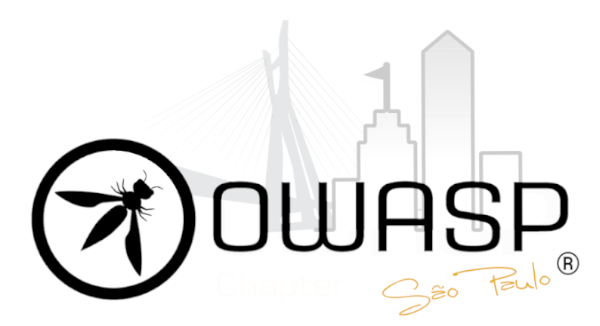

---

layout: col-sidebar
title: OWASP Sao Paulo
tags: participation-tag sponsorship-tag
level: 0

region: South America

---

## Welcome
Welcome to the <a href="https://pt.wikipedia.org/wiki/S%C3%A3o_Paulo">São Paulo</a> chapter homepage

 

## Por que fazer parte da OWASP São Paulo?
<ul>
<li>A comunidade organiza encontros onde especialistas fazem apresentações e seminários sobre tópicos de segurança de software.</li>
<li>A participação na comunidade aumentará seus conhecimentos e habilidades.</li>
<li>Oportunidade de interagir com outros profissionais de software aumentando os seus contatos na região.</li>
<li>A participação nas listas de discussão e a participação nas sessões da OWASP São Paulo são gratuitas.</li>
</ul>
 

## Agradecimentos da equipe OWASP Chapter São Paulo
<b>FECHANDO 2019</b> 
Firmeza e constância de propósito. Essa frase resume bem o ano de 2019 para nós da OWASP SP. 
Tivemos a firmeza de seguir em frente e enfrentar novos desafios. Ao todo foram 10 meetups realizados em 2019, na capital e em cidades do interior de SP! 
A constância de propósito de que é possível ser voluntário e levar a missão da OWASP para tornar as aplicações mais seguras! 
Isso foi possível graças ao apoio incondicional da comunidade e membros da OWASP, que palestraram e prestigiaram todas as nossas iniciativas. 
E parafraseando o grande Eoin Keary, "Na OWASP, estamos tentando tornar o mundo um lugar onde software inseguro seja a anomalia, não a regra". 
Continuamos fazendo o nosso melhor e esperamos ter feito a nossa parte! 
 
Viva 2019 e que venha 2020! 
 
<b>FECHANDO 2018</b> 
E quatro meses se passaram desde a reativação da OWASP em São Paulo. 
Quatro meses de muito trabalho e também de muitas realizações. 
Quatro meses conhecendo novas pessoas e trocando muitas experiências. 
Quatro meses contribuindo para um entidade que completa 17 anos de apoio à comunidade. 
Esperamos ter contribuído com todos os membros OWASP e as pessoas que participaram dos nossos 7 eventos realizados nesse ano. 
Agradecemos os patrocinadores e palestrantes que acreditaram e nos ajudaram a levar a missão da OWASP para tornar as aplicações mais seguras! 
E parafraseando o grande Eoin Keary, "Na OWASP, estamos tentando tornar o mundo um lugar onde software inseguro seja a anomalia, não a regra". 
Fizemos o nosso melhor e esperamos ter feito a nossa parte! 
 
E que venha 2019! 
 
