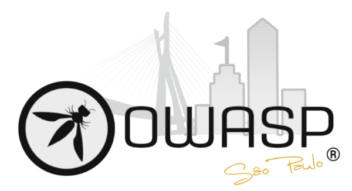

---

layout: col-sidebar
title: OWASP Sao Paulo
tags: chapter-sp
level: 0

region: South America

---

## Seja bem-vindo!
Seja bem-vindo a página da OWASP Chapter São Paulo! 
 

 
A OWASP São Paulo é um dos 9 capítulos brasileiros entre os mais de 270 Capítulos ativos em todo o mundo. Nosso objetivo é disseminar a missão da OWASP, tornando a segurança das aplicações visível, para que as pessoas e organizações possam tomar decisões conscientes sobre os verdadeiros riscos de segurança das aplicações. 
Serão realizados encontros para que as pessoas possam compartilhar conhecimentos, discutir e aprender sobre segurança de software. A organização também tem muitos projetos ativos nos quais os voluntários podem participar para criar códigos e documentos para a comunidade mundial de segurança. 
 

## Por que fazer parte da OWASP São Paulo?
<ul>
<li>A comunidade organiza encontros onde especialistas fazem apresentações e seminários sobre tópicos de segurança de software.</li>
<li>A participação na comunidade aumentará seus conhecimentos e habilidades.</li>
<li>Oportunidade de interagir com outros profissionais de software aumentando os seus contatos na região.</li>
<li>A participação nas listas de discussão e a participação nas sessões da OWASP São Paulo são gratuitas.</li>
</ul>
 
